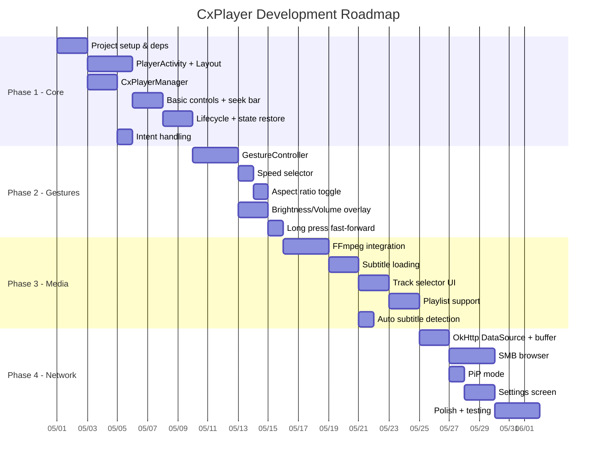

# CxPlayer - Video Player App: Kế hoạch & Specs

## 1. Tổng quan dự án

**Tên ứng dụng**: CxPlayer
**Mô tả**: Ứng dụng phát video Android hiệu năng cao, tối ưu cho phát video qua mạng LAN
**Ngôn ngữ**: Kotlin
**Min SDK**: 24 (Android 7.0) | **Target SDK**: 35
**Kiến trúc**: Single-Activity + MVVM + Clean Architecture

### Tech Stack

| Layer | Technology |
|-------|-----------|
| Media Engine | AndroidX Media3 (ExoPlayer) 1.5.x |
| Audio Decoder | Media3 FFmpeg Extension |
| Network | OkHttp 4.x + Media3 OkHttp DataSource |
| DI | Hilt |
| UI | Material 3 + Jetpack Compose (controls overlay) |
| Persistence | DataStore Preferences |
| File Browse | SAF (Storage Access Framework) + SMB (smbj) |

---

## 2. Features (theo phân tích Cx File Explorer)

### P0 - Core (Phase 1)
- [x] Phát video local (file://, content://)
- [x] Phát video qua HTTP/HTTPS (LAN NAS, web)
- [x] Hardware-accelerated decoding
- [x] Fullscreen immersive mode
- [x] Basic controls: play/pause, seek bar, time display
- [x] Seek forward/backward 10s
- [x] Keep screen on during playback
- [x] Resume playback position (savedInstanceState)

### P1 - Enhanced Controls (Phase 2)
- [ ] Gesture: swipe volume (right half)
- [ ] Gesture: swipe brightness (left half)
- [ ] Gesture: horizontal swipe seek
- [ ] Gesture: pinch-to-zoom
- [ ] Gesture: double-tap play/pause
- [ ] Long press fast-forward (2x speed)
- [ ] Playback speed: 0.25x → 2x (8 levels)
- [ ] Aspect ratio toggle (Fit/Fill/Crop/16:9/4:3)
- [ ] Repeat mode (Off/One/All)

### P2 - Advanced Media (Phase 3)
- [ ] FFmpeg audio decoder (AC3, DTS, FLAC, TrueHD, etc.)
- [ ] External subtitle loading (SRT, ASS/SSA, VTT)
- [ ] Embedded subtitle track selection
- [ ] Audio track selection
- [ ] Subtitle styling (font size, bold, color)
- [ ] Playlist / queue (multiple videos)
- [ ] Shuffle mode
- [ ] Next/Previous controls

### P3 - Network & Polish (Phase 4)
- [ ] SMB/CIFS network share browsing & playback
- [ ] FTP/SFTP playback
- [ ] Aggressive buffering config for LAN
- [ ] Wake lock (WAKE_MODE_NETWORK)
- [ ] Picture-in-Picture (PiP) mode
- [ ] Background audio playback
- [ ] Auto-rotation / orientation lock
- [ ] Settings screen (default speed, subtitle size, buffer config)

---

## 3. Kiến trúc ứng dụng

```
app/
├── data/
│   ├── preferences/         # DataStore - user settings
│   ├── datasource/          # DataSource factories (OkHttp, SMB)
│   └── repository/          # PlaybackStateRepository
├── domain/
│   ├── model/               # VideoItem, SubtitleTrack, PlaybackState
│   └── usecase/             # PlayVideo, LoadSubtitle, BrowseNetwork
├── player/
│   ├── CxPlayerManager.kt          # ExoPlayer lifecycle wrapper
│   ├── CxRenderersFactory.kt       # FFmpeg-enabled renderers
│   ├── CxLoadControl.kt            # Custom buffer config
│   ├── CxTrackSelector.kt          # Track selection logic
│   └── CxMediaSourceFactory.kt     # URI → MediaSource resolver
├── ui/
│   ├── player/
│   │   ├── PlayerActivity.kt       # Single Activity (entry point)
│   │   ├── PlayerViewModel.kt      # UI state management
│   │   ├── PlayerOverlay.kt        # Compose-based control overlay
│   │   └── GestureController.kt    # Touch gesture handler
│   ├── controls/
│   │   ├── SpeedSelector.kt        # Speed picker popup
│   │   ├── TrackSelector.kt        # Audio/subtitle picker
│   │   └── SubtitleDialog.kt       # Subtitle settings
│   └── settings/
│       └── SettingsActivity.kt
└── util/
    ├── UriResolver.kt               # content:// → file path
    └── TimeFormatter.kt
```

---

## 4. Specs chi tiết theo Phase

### Phase 1: Core Player (2 tuần)

#### 4.1.1 PlayerActivity

```kotlin
// Intent contract
data class PlayerIntent(
    val uris: List<Uri>,          // Video URIs
    val startIndex: Int = 0,      // Start at which video
    val startPositionMs: Long = 0 // Resume position
)

// Launch via Intent
intent.action = Intent.ACTION_VIEW
intent.data = videoUri  // single video
// OR
intent.putParcelableArrayListExtra("uris", uriList) // playlist
```

**Manifest declaration:**
```xml
<activity
    android:name=".ui.player.PlayerActivity"
    android:configChanges="orientation|screenSize|keyboardHidden"
    android:launchMode="singleTask"
    android:theme="@style/Theme.CxPlayer.Fullscreen">
    <intent-filter>
        <action android:name="android.intent.action.VIEW" />
        <category android:name="android.intent.category.DEFAULT" />
        <data android:scheme="http" />
        <data android:scheme="https" />
        <data android:scheme="content" />
        <data android:scheme="file" />
        <data android:mimeType="video/mp4" />
        <data android:mimeType="video/3gpp" />
        <data android:mimeType="video/webm" />
        <data android:mimeType="video/x-matroska" />
    </intent-filter>
</activity>
```

#### 4.1.2 CxPlayerManager

```kotlin
class CxPlayerManager(private val context: Context) {
    private var player: ExoPlayer? = null

    fun initialize() {
        val trackSelector = DefaultTrackSelector(context)

        player = ExoPlayer.Builder(context)
            .setTrackSelector(trackSelector)
            .setSeekForwardIncrementMs(10_000)
            .setSeekBackIncrementMs(10_000)
            .build().apply {
                setAudioAttributes(AudioAttributes.DEFAULT, /* handleFocus */ true)
                setWakeMode(C.WAKE_MODE_LOCAL)
                playWhenReady = true
            }
    }

    fun play(uris: List<Uri>, startIndex: Int = 0, positionMs: Long = 0) {
        val mediaItems = uris.map { MediaItem.fromUri(it) }
        player?.apply {
            setMediaItems(mediaItems, startIndex, positionMs)
            prepare()
        }
    }

    fun release() {
        player?.release()
        player = null
    }
}
```

#### 4.1.3 Layout: activity_player.xml

```
┌──────────────────────────────────────────┐
│ [← Back]  Video Title           [...Menu]│  ← Toolbar (auto-hide)
│                                          │
│                                          │
│                                          │
│              PlayerView                  │  ← ExoPlayer PlayerView
│           (full screen)                  │
│                                          │
│                                          │
│                                          │
│  00:12:34 ═══════●═══════════ 01:45:00   │  ← SeekBar
│       [⏪]    [⏯️]    [⏩]    [🔊] [⚙️]  │  ← Controls bar
└──────────────────────────────────────────┘
```

#### 4.1.4 Lifecycle Management

```
onCreate  → inflate layout, parse intent
onStart   → initializePlayer() (API 24+)
onResume  → initializePlayer() (API 23-)
onPause   → releasePlayer()   (API 23-)
onStop    → releasePlayer()   (API 24+)
onDestroy → cleanup
onSaveInstanceState → save position, window, autoPlay, speed
```

---

### Phase 2: Gesture Controls (1.5 tuần)

#### 4.2.1 GestureController

```kotlin
class GestureController(
    private val playerView: PlayerView,
    private val onVolumeChange: (delta: Float) -> Unit,
    private val onBrightnessChange: (delta: Float) -> Unit,
    private val onSeekDelta: (deltaMs: Long) -> Unit,
    private val onTogglePlayPause: () -> Unit,
    private val onFastForward: (speed: Float) -> Unit,
    private val onFastForwardEnd: () -> Unit,
    private val onZoom: (scaleFactor: Float) -> Unit
)
```

**Gesture mapping (phân tích từ Cx File Explorer):**

| Gesture | Zone | Action |
|---------|------|--------|
| Swipe vertical | Right 50% | Volume ±1 per 150px |
| Swipe vertical | Left 50% | Brightness ±0.05 per 150px |
| Swipe horizontal | Any | Seek ±(distance * 100)ms |
| Double tap | Center | Play/Pause |
| Double tap | Left 33% | Seek -10s |
| Double tap | Right 33% | Seek +10s |
| Long press | Any | Fast forward 2x (release → normal) |
| Pinch | Any | Zoom video (1.0 → 3.0x) |

**Overlay UI khi gesture:**
```
┌──────────────────────────────┐
│                              │
│        🔊 Volume: 75%        │  ← Right swipe up
│        ☀️ Brightness: 60%    │  ← Left swipe up
│        ▶▶ 2X ▶▶             │  ← Long press
│        ◀ -00:30              │  ← Left swipe horizontal
│                              │
└──────────────────────────────┘
```

#### 4.2.2 SpeedSelector

```kotlin
// Speeds from Cx File Explorer analysis
val SPEED_OPTIONS = listOf(
    SpeedOption("0.25x", 0.25f),
    SpeedOption("0.5x",  0.5f),
    SpeedOption("0.75x", 0.75f),
    SpeedOption("1x",    1.0f),    // default
    SpeedOption("1.25x", 1.25f),
    SpeedOption("1.5x",  1.5f),
    SpeedOption("1.75x", 1.75f),
    SpeedOption("2x",    2.0f),
)
```

#### 4.2.3 Aspect Ratio

```kotlin
enum class AspectRatio(val mode: Int) {
    FIT(AspectRatioFrameLayout.RESIZE_MODE_FIT),       // default
    FILL(AspectRatioFrameLayout.RESIZE_MODE_FILL),
    ZOOM(AspectRatioFrameLayout.RESIZE_MODE_ZOOM),
    FIXED_16_9(AspectRatioFrameLayout.RESIZE_MODE_FIXED_WIDTH),
    FIXED_4_3(AspectRatioFrameLayout.RESIZE_MODE_FIXED_HEIGHT),
}
```

---

### Phase 3: Advanced Media (2 tuần)

#### 4.3.1 FFmpeg Integration

```groovy
// build.gradle
dependencies {
    implementation "androidx.media3:media3-decoder-ffmpeg:1.5.1"
}
```

```kotlin
class CxRenderersFactory(context: Context) : DefaultRenderersFactory(context) {
    init {
        setExtensionRendererMode(EXTENSION_RENDERER_MODE_PREFER)
        // FFmpeg decoder sẽ được ưu tiên trước MediaCodec
    }
}
```

**Codec support matrix:**

| Codec | Hardware | FFmpeg | Notes |
|-------|----------|--------|-------|
| H.264 | ✅ | fallback | Most common |
| H.265/HEVC | ✅ | fallback | 4K content |
| VP9 | ✅ | fallback | WebM |
| AV1 | varies | ✅ | Newer devices only |
| AAC | ✅ | ✅ | |
| AC3/EAC3 | ❌ | ✅ | Movie audio |
| DTS/DTS-HD | ❌ | ✅ | Blu-ray audio |
| FLAC | ✅ | ✅ | |
| TrueHD | ❌ | ✅ | Lossless |
| Opus | ✅ | ✅ | |
| Vorbis | ✅ | ✅ | |

#### 4.3.2 Subtitle System

```kotlin
class SubtitleManager(private val player: ExoPlayer) {

    // Load external subtitle file
    fun loadExternalSubtitle(uri: Uri, mimeType: String = MimeTypes.APPLICATION_SUBRIP) {
        val subtitle = MediaItem.SubtitleConfiguration.Builder(uri)
            .setMimeType(mimeType)
            .setLanguage("vi")
            .setSelectionFlags(C.SELECTION_FLAG_DEFAULT)
            .build()
        // Rebuild current MediaItem with subtitle
        val current = player.currentMediaItem ?: return
        val updated = current.buildUpon()
            .setSubtitleConfigurations(listOf(subtitle))
            .build()
        val pos = player.currentPosition
        player.setMediaItem(updated, pos)
        player.prepare()
    }

    // Detect subtitle files next to video
    fun autoDetectSubtitle(videoUri: Uri): Uri? {
        val videoPath = videoUri.path ?: return null
        val baseName = videoPath.substringBeforeLast(".")
        val extensions = listOf(".srt", ".ass", ".ssa", ".vtt")
        for (ext in extensions) {
            val subFile = File(baseName + ext)
            if (subFile.exists()) return Uri.fromFile(subFile)
        }
        return null
    }

    // Style configuration (from Cx analysis: N3() method)
    fun setSubtitleStyle(fontSize: Int, bold: Boolean) {
        val typeface = if (bold) Typeface.DEFAULT_BOLD else Typeface.DEFAULT
        playerView.subtitleView?.setStyle(
            CaptionStyleCompat(
                Color.WHITE,        // foreground
                Color.TRANSPARENT,  // background
                Color.TRANSPARENT,  // window
                CaptionStyleCompat.EDGE_TYPE_OUTLINE,
                Color.BLACK,        // edge color
                typeface
            )
        )
        playerView.subtitleView?.setFixedTextSize(TypedValue.COMPLEX_UNIT_SP, fontSize.toFloat())
    }
}
```

**Supported subtitle formats:**
- `.srt` (SubRip) → `application/x-subrip`
- `.ass` / `.ssa` (Advanced SubStation Alpha) → `text/x-ssa`
- `.vtt` (WebVTT) → `text/vtt`
- Embedded subtitles in MKV/MP4

#### 4.3.3 Track Selector UI

```kotlin
data class TrackInfo(
    val groupIndex: Int,
    val trackIndex: Int,
    val label: String,      // "English", "Vietnamese", "5.1 AC3"
    val isSelected: Boolean,
    val type: Int            // C.TRACK_TYPE_AUDIO or C.TRACK_TYPE_TEXT
)
```

**UI: PopupWindow with RecyclerView (giống Cx File Explorer class `f`)**

```
┌─────────────────────┐
│ 🔊 Audio Tracks     │
│ ● English 5.1 (AC3) │
│ ○ Vietnamese Stereo  │
│ ○ Japanese Stereo    │
├─────────────────────┤
│ 💬 Subtitles        │
│ ● Vietnamese (SRT)   │
│ ○ English (embedded) │
│ ○ Off                │
└─────────────────────┘
```

---

### Phase 4: Network & Polish (2 tuần)

#### 4.4.1 LAN Streaming Optimization

```kotlin
class CxLoadControl : DefaultLoadControl(
    DefaultAllocator(true, C.DEFAULT_BUFFER_SEGMENT_SIZE),
    /* minBufferMs */           50_000,   // 50s min buffer
    /* maxBufferMs */           120_000,  // 2min max buffer
    /* bufferForPlaybackMs */   2_500,    // Start after 2.5s
    /* bufferForRebufferMs */   5_000,    // After rebuffer: 5s
    DefaultLoadControl.DEFAULT_TARGET_BUFFER_BYTES,
    DefaultLoadControl.DEFAULT_PRIORITIZE_TIME_OVER_SIZE,
    DefaultLoadControl.DEFAULT_BACK_BUFFER_DURATION_MS,
    DefaultLoadControl.DEFAULT_RETAIN_BACK_BUFFER_FROM_KEYFRAME,
)

// OkHttp DataSource for better HTTP handling
class CxDataSourceFactory(context: Context) {
    private val okHttpClient = OkHttpClient.Builder()
        .connectTimeout(15, TimeUnit.SECONDS)
        .readTimeout(30, TimeUnit.SECONDS)
        .build()

    fun create(): DataSource.Factory {
        return OkHttpDataSource.Factory(okHttpClient)
            .setDefaultRequestProperties(mapOf(
                "User-Agent" to "CxPlayer/1.0"
            ))
    }
}
```

**Wake mode configuration:**
```kotlin
// Network playback → keep WiFi alive
if (isNetworkUri(uri)) {
    player.setWakeMode(C.WAKE_MODE_NETWORK)  // WiFi + CPU lock
} else {
    player.setWakeMode(C.WAKE_MODE_LOCAL)     // CPU lock only
}
```

#### 4.4.2 SMB Network Browser

```kotlin
// Using smbj library
dependencies {
    implementation "com.hierynomus:smbj:0.13.0"
}

class SmbBrowser {
    fun connect(host: String, share: String, user: String, pass: String): List<FileInfo>
    fun openStream(path: String): InputStream  // → pipe to DataSource
}
```

#### 4.4.3 PiP Mode

```kotlin
// In PlayerActivity
override fun onUserLeaveHint() {
    if (Build.VERSION.SDK_INT >= 26 && player?.isPlaying == true) {
        enterPictureInPictureMode(
            PictureInPictureParams.Builder()
                .setAspectRatio(Rational(16, 9))
                .build()
        )
    }
}
```

#### 4.4.4 Settings

| Setting | Type | Default | Storage |
|---------|------|---------|---------|
| Default speed | Float | 1.0 | DataStore |
| Subtitle font size | Int | 16 | DataStore |
| Subtitle bold | Boolean | false | DataStore |
| Resume playback | Boolean | true | DataStore |
| Buffer size (LAN) | Enum | Normal | DataStore |
| Auto-rotate | Boolean | true | DataStore |
| Swipe sensitivity | Float | 1.0 | DataStore |
| Default aspect ratio | Enum | Fit | DataStore |
| Preferred audio lang | String | "" | DataStore |
| Preferred subtitle lang | String | "vi" | DataStore |

---

## 5. Dependencies (build.gradle)

```groovy
plugins {
    id 'com.android.application'
    id 'org.jetbrains.kotlin.android'
    id 'com.google.dagger.hilt.android'
    id 'kotlin-kapt'
}

android {
    namespace 'com.cxplayer'
    compileSdk 35
    defaultConfig {
        minSdk 24
        targetSdk 35
    }
}

dependencies {
    // Media3 / ExoPlayer
    def media3 = "1.5.1"
    implementation "androidx.media3:media3-exoplayer:$media3"
    implementation "androidx.media3:media3-exoplayer-hls:$media3"
    implementation "androidx.media3:media3-exoplayer-dash:$media3"
    implementation "androidx.media3:media3-ui:$media3"
    implementation "androidx.media3:media3-common:$media3"
    implementation "androidx.media3:media3-datasource:$media3"
    implementation "androidx.media3:media3-datasource-okhttp:$media3"
    implementation "androidx.media3:media3-extractor:$media3"
    implementation "androidx.media3:media3-session:$media3"

    // FFmpeg decoder extension (requires NDK build)
    implementation "androidx.media3:media3-decoder-ffmpeg:$media3"

    // Network
    implementation "com.squareup.okhttp3:okhttp:4.12.0"
    implementation "com.hierynomus:smbj:0.13.0"         // SMB

    // Android
    implementation "com.google.android.material:material:1.12.0"
    implementation "androidx.appcompat:appcompat:1.7.0"
    implementation "androidx.core:core-ktx:1.15.0"
    implementation "androidx.lifecycle:lifecycle-viewmodel-ktx:2.8.7"
    implementation "androidx.datastore:datastore-preferences:1.1.4"

    // Compose (for control overlay)
    implementation platform("androidx.compose:compose-bom:2024.12.01")
    implementation "androidx.compose.ui:ui"
    implementation "androidx.compose.material3:material3"
    implementation "androidx.activity:activity-compose:1.9.3"

    // DI
    implementation "com.google.dagger:hilt-android:2.53.1"
    kapt "com.google.dagger:hilt-compiler:2.53.1"
}
```

---

## 6. Roadmap



**Estimated total: ~7.5 tuần**

---

## 7. Testing Strategy

| Test Type | Tool | Coverage |
|-----------|------|----------|
| Unit | JUnit 5 + Mockk | ViewModel, UseCase, URI resolver |
| Integration | Robolectric | Player lifecycle, gesture math |
| Instrumented | Espresso | UI controls, seek, speed |
| Manual | Device farm | LAN streaming, codec compat |

**Key test scenarios:**
1. Play local MP4 → verify playback starts, controls work
2. Play HTTP URL → verify buffering indicator, wake lock
3. Rotate device → verify position preserved
4. Kill app → verify resume on reopen
5. Load SRT subtitle → verify display and timing
6. Swipe gestures → verify volume/brightness/seek deltas
7. Play MKV with DTS audio → verify FFmpeg decoder kicks in
8. SMB share → verify browse + playback
9. PiP transition → verify playback continues

---

## 8. Tham chiếu từ Cx File Explorer

| Cx Component (obfuscated) | Chức năng | CxPlayer equivalent |
|---|---|---|
| `VideoPlayerActivity` | Main player | `PlayerActivity` |
| `VideoPlayerActivity$u` | Custom RenderersFactory | `CxRenderersFactory` |
| `VideoPlayerActivity$s` | Touch listener (scale+gesture+long press) | `GestureController` |
| `VideoPlayerActivity$e` | ScaleGestureDetector | `GestureController.onScale()` |
| `VideoPlayerActivity$f` | SimpleGestureDetector | `GestureController.onSwipe()` |
| `VideoPlayerActivity$x` | Player.Listener | `PlayerViewModel` observer |
| `VideoPlayerActivity$y` | OrientationEventListener | `OrientationHandler` |
| `VideoPlayerActivity$l` | Speed item selected listener | `SpeedSelector` |
| `viewer.a` | Long-press gesture detector | `LongPressGestureDetector` |
| `viewer.d` | Speed ArrayAdapter (0.25x→2x) | `SpeedSelector` |
| `viewer.e` | Video playlist singleton | `PlaylistManager` |
| `viewer.f` | Track selection popup (audio+subtitle) | `TrackSelectorDialog` |
| `FfmpegLibrary` | FFmpeg native loader | Media3 built-in |
| `FfmpegDecoder` | JNI bridge to FFmpeg | Media3 built-in |
